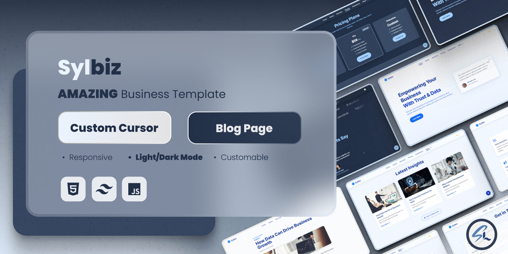

<!-- BANNER -->
## 🌟 **Welcome to My Profile!**
<!-- TYPING ANIMATION -->
<p align="center">
  
</p>

<!-- SOCIAL MEDIA BADGES -->
<p align="center">
  <a href="https://github.com/syalomclubby"></a>
  <a href="https://linkedin.com/in/syalom-layezar"></a>
  <a href="https://discord.com/invite/v58xB2unpE"></a>
  <a href="#"></a>
  <a href="https://instagram.com/syalom_lyz"></a>
</p>

---

## 🧑‍💻 **About Me**
```yaml
👨‍💻 Developer | 🎮 Gamer | 🎹 Musician | 📡 Server Admin | 🌎 Tech Enthusiast
🚀 Passionate about creating, optimizing, and exploring new technologies.
🎵 I make music, edit videos, and build awesome projects!
```

---

## 🛠️ **Tech Stack**
<p>
  
  
  
  
  
  
  
</p>

---

# 🧩 Sylbiz – Clean Business Website Template

### 🚀 Live Demo: [sylbiz.vercel.app](https://sylbiz.vercel.app)



> Sylbiz is currently my best and most complete front-end project.
> It reflects my current design principles, code structure, and attention to responsive user interface built with Tailwind CSS.
> A modern and responsive business website UI built with **Tailwind CSS**, designed for startups, agencies, and corporate teams seeking a polished online presence.

---

## ✨ Features

- ✅ Built with **Tailwind CSS v3+**
- 🌗 Fully responsive with **dark mode toggle**
- 📱 Mobile-first and cross-browser compatible
- 📰 Includes static **blog section**
- 💼 Sections: Hero, About, Services, Pricing, Testimonials, FAQ
- 🎯 Smooth scroll animations using **AOS**
- 🧠 Clean semantic HTML structure
- 💡 Custom cursor, scroll-to-top button, and dropdown nav
- ⚙️ Easy to customize and extend

---

## 🛠 Development

To develop or customize with Tailwind CSS:

```bash
npm install
npm run dev:css   # For development with live updates
# When done:
Ctrl + C
npm run build:css # Minifies CSS for production
```

> No build tools required for basic editing. Just open `index.html` directly in your browser.

---

## 📌 Tech Stack

- **HTML5**, **Tailwind CSS**, **Vanilla JavaScript**
- AOS (Animate On Scroll)
- Swiper.js (for testimonials)
- Font Awesome (CDN icons)

---

## 🛒 Buy This Template

You can purchase the full version of this template on:

👉 [Codester – Sylbiz Template](https://www.codester.com/items/56015/sylbiz-multipurpose-business-template)

Includes full source code, lifetime access, and commercial usage rights.

## 📫 **Let’s Connect!**
I'm open to collaboration, freelance work, and exciting tech ideas. Feel free to reach out!

> **🔒 Note for Reviewers:**  
> All featured projects are created and managed by **SyalomClubby**  
> Email: itzclubbykunz@gmail.com (same email used in Creative Market submission)

